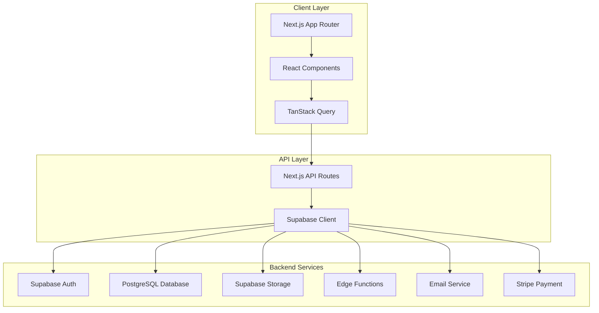

# Design Document

## Overview

Astewai is a modern full-stack digital bookstore built with Next.js 14, TypeScript, and Supabase. The platform follows a clean architecture pattern with clear separation between presentation, business logic, and data layers. The design emphasizes performance, scalability, and user experience with server-side rendering, optimistic updates, and responsive design.

## Architecture

### Technology Stack

**Frontend:**
- Next.js 14 with App Router for server-side rendering and routing
- TypeScript for type safety and developer experience
- Tailwind CSS for styling and responsive design
- Shadcn/ui for consistent UI components
- React Query (TanStack Query) for data fetching and caching

**Backend:**
- Supabase for authentication, database, and real-time features
- PostgreSQL database with Row Level Security (RLS)
- Supabase Storage for book files and cover images
- Edge Functions for custom business logic
- Email service (Resend or Supabase built-in) for transactional emails
- Payment processing (Stripe) for secure transactions

**Package Management:**
- pnpm for fast, efficient package management

### System Architecture



## Components and Interfaces

### Core Components

**Authentication Components:**
- `AuthProvider`: Context provider for authentication state
- `LoginForm`: Email/password login with validation
- `RegisterForm`: User registration with profile creation
- `ProtectedRoute`: Route guard for authenticated users
- `RoleGuard`: Component for role-based access control

**Book Components:**
- `BookGrid`: Responsive grid layout for book listings
- `BookCard`: Individual book display with cover, title, author
- `BookDetail`: Detailed book view with preview and purchase options
- `BookReader`: Reading interface with progress tracking
- `SearchBar`: Book search with filtering capabilities

**Bundle Components:**
- `BundleGrid`: Display curated book bundles
- `BundleCard`: Individual bundle with pricing and book count
- `BundleDetail`: Detailed bundle view with included books

**Library Components:**
- `LibraryTabs`: Tabbed interface for All/In Progress/Completed
- `LibraryGrid`: User's book collection with status indicators
- `ProgressBar`: Visual reading progress indicator
- `BookStatus`: Status badges (Owned, Pending, etc.)

**Blog Components:**
- `BlogList`: Filterable list of blog posts
- `BlogCard`: Individual blog post preview
- `BlogPost`: Full blog post reader
- `BlogFilter`: Category and tag filtering

**Admin Components:**
- `AdminDashboard`: Main admin interface
- `BookUpload`: Book creation and editing form
- `BundleManager`: Bundle creation and management
- `UserManager`: User role and profile management
- `PaymentRequests`: Approval workflow for manual purchases

### Data Interfaces

```typescript
interface User {
  id: string;
  email: string;
  profile: UserProfile;
  role: 'user' | 'admin';
  created_at: string;
}

interface UserProfile {
  id: string;
  user_id: string;
  display_name: string;
  avatar_url?: string;
  reading_preferences: ReadingPreferences;
}

interface Book {
  id: string;
  title: string;
  author: string;
  description: string;
  cover_image_url: string;
  content_url: string;
  price: number;
  is_free: boolean;
  category: string;
  tags: string[];
  created_at: string;
  updated_at: string;
}

interface Bundle {
  id: string;
  title: string;
  description: string;
  price: number;
  books: Book[];
  created_at: string;
  updated_at: string;
}

interface UserLibrary {
  id: string;
  user_id: string;
  book_id: string;
  status: 'owned' | 'pending' | 'completed';
  progress: number;
  last_read_position: string;
  added_at: string;
}

interface BlogPost {
  id: string;
  title: string;
  content: string;
  excerpt: string;
  author_id: string;
  category: string;
  tags: string[];
  published: boolean;
  created_at: string;
  updated_at: string;
}

interface Purchase {
  id: string;
  user_id: string;
  item_type: 'book' | 'bundle';
  item_id: string;
  amount: number;
  status: 'pending' | 'approved' | 'rejected' | 'completed';
  created_at: string;
  updated_at: string;
}
```

## Data Models

### Database Schema

**Users Table (Supabase Auth):**
- Managed by Supabase Auth
- Extended with profiles table for additional user data

**Profiles Table:**
```sql
CREATE TABLE profiles (
  id UUID REFERENCES auth.users ON DELETE CASCADE,
  display_name TEXT,
  avatar_url TEXT,
  role TEXT DEFAULT 'user' CHECK (role IN ('user', 'admin')),
  reading_preferences JSONB DEFAULT '{}',
  created_at TIMESTAMP WITH TIME ZONE DEFAULT NOW(),
  updated_at TIMESTAMP WITH TIME ZONE DEFAULT NOW(),
  PRIMARY KEY (id)
);
```

**Books Table:**
```sql
CREATE TABLE books (
  id UUID DEFAULT gen_random_uuid() PRIMARY KEY,
  title TEXT NOT NULL,
  author TEXT NOT NULL,
  description TEXT,
  cover_image_url TEXT,
  content_url TEXT,
  price DECIMAL(10,2) DEFAULT 0,
  is_free BOOLEAN DEFAULT false,
  category TEXT,
  tags TEXT[],
  created_at TIMESTAMP WITH TIME ZONE DEFAULT NOW(),
  updated_at TIMESTAMP WITH TIME ZONE DEFAULT NOW()
);
```

**Bundles Table:**
```sql
CREATE TABLE bundles (
  id UUID DEFAULT gen_random_uuid() PRIMARY KEY,
  title TEXT NOT NULL,
  description TEXT,
  price DECIMAL(10,2) NOT NULL,
  created_at TIMESTAMP WITH TIME ZONE DEFAULT NOW(),
  updated_at TIMESTAMP WITH TIME ZONE DEFAULT NOW()
);
```

**Bundle_Books Table (Many-to-Many):**
```sql
CREATE TABLE bundle_books (
  bundle_id UUID REFERENCES bundles(id) ON DELETE CASCADE,
  book_id UUID REFERENCES books(id) ON DELETE CASCADE,
  PRIMARY KEY (bundle_id, book_id)
);
```

**User_Library Table:**
```sql
CREATE TABLE user_library (
  id UUID DEFAULT gen_random_uuid() PRIMARY KEY,
  user_id UUID REFERENCES auth.users(id) ON DELETE CASCADE,
  book_id UUID REFERENCES books(id) ON DELETE CASCADE,
  status TEXT DEFAULT 'owned' CHECK (status IN ('owned', 'pending', 'completed')),
  progress INTEGER DEFAULT 0 CHECK (progress >= 0 AND progress <= 100),
  last_read_position TEXT,
  added_at TIMESTAMP WITH TIME ZONE DEFAULT NOW(),
  UNIQUE(user_id, book_id)
);
```

**Blog_Posts Table:**
```sql
CREATE TABLE blog_posts (
  id UUID DEFAULT gen_random_uuid() PRIMARY KEY,
  title TEXT NOT NULL,
  content TEXT NOT NULL,
  excerpt TEXT,
  author_id UUID REFERENCES auth.users(id),
  category TEXT,
  tags TEXT[],
  published BOOLEAN DEFAULT false,
  created_at TIMESTAMP WITH TIME ZONE DEFAULT NOW(),
  updated_at TIMESTAMP WITH TIME ZONE DEFAULT NOW()
);
```

**Purchases Table:**
```sql
CREATE TABLE purchases (
  id UUID DEFAULT gen_random_uuid() PRIMARY KEY,
  user_id UUID REFERENCES auth.users(id) ON DELETE CASCADE,
  item_type TEXT NOT NULL CHECK (item_type IN ('book', 'bundle')),
  item_id UUID NOT NULL,
  amount DECIMAL(10,2) NOT NULL,
  status TEXT DEFAULT 'pending' CHECK (status IN ('pending', 'approved', 'rejected', 'completed')),
  payment_provider_id TEXT, -- Stripe charge/payment intent ID for reconciliation
  created_at TIMESTAMP WITH TIME ZONE DEFAULT NOW(),
  updated_at TIMESTAMP WITH TIME ZONE DEFAULT NOW()
);
```

**Reviews Table (Future Enhancement):**
```sql
CREATE TABLE reviews (
  id UUID DEFAULT gen_random_uuid() PRIMARY KEY,
  user_id UUID REFERENCES auth.users(id) ON DELETE CASCADE,
  book_id UUID REFERENCES books(id) ON DELETE CASCADE,
  rating INTEGER CHECK (rating >= 1 AND rating <= 5),
  comment TEXT,
  created_at TIMESTAMP WITH TIME ZONE DEFAULT NOW(),
  UNIQUE(user_id, book_id)
);
```

### Row Level Security (RLS) Policies

- Users can only read their own profile and library data
- Books and bundles are publicly readable
- Blog posts are publicly readable when published
- Admin users have full access to all data
- Purchase records are only accessible to the user and admins

## Error Handling

### Client-Side Error Handling

**Authentication Errors:**
- Invalid credentials: Display user-friendly error message
- Session expiry: Redirect to login with return URL
- Network errors: Show retry mechanism with offline indicator

**Data Fetching Errors:**
- API failures: Display error boundaries with retry options
- Loading states: Show skeleton loaders and progress indicators
- Optimistic updates: Rollback on failure with user notification

**Form Validation:**
- Real-time validation with clear error messages
- Server-side validation errors displayed inline
- File upload errors with progress and retry options

### Server-Side Error Handling

**Database Errors:**
- Connection failures: Implement retry logic with exponential backoff
- Constraint violations: Return specific error messages
- Transaction failures: Proper rollback and error reporting

**Authentication Errors:**
- Invalid tokens: Return 401 with clear error message
- Insufficient permissions: Return 403 with role requirements
- Rate limiting: Implement and communicate limits to users

**File Storage Errors:**
- Upload failures: Provide retry mechanism and error details
- File not found: Graceful fallback to default images
- Storage quota: Alert admins and provide upgrade path

## Testing Strategy

### Unit Testing
- Component testing with React Testing Library
- Hook testing for custom React hooks
- Utility function testing with Jest
- Database function testing with Supabase local development

### Integration Testing
- API route testing with Next.js test utilities
- Database integration testing with test database
- Authentication flow testing with mock Supabase client
- File upload testing with mock storage

### End-to-End Testing
- User journey testing with Playwright
- Critical path testing (registration, purchase, reading)
- Admin workflow testing
- Cross-browser compatibility testing

### Performance Testing
- Page load performance with Lighthouse
- Database query optimization testing
- Image optimization and loading testing
- Bundle size monitoring

### Security Testing
- Authentication and authorization testing
- SQL injection prevention testing
- XSS prevention testing
- File upload security testing

### Accessibility Testing
- Screen reader compatibility
- Keyboard navigation testing
- Color contrast validation
- ARIA label verification

The design ensures a scalable, maintainable, and user-friendly digital bookstore platform that can grow with user needs while maintaining high performance and security standards.